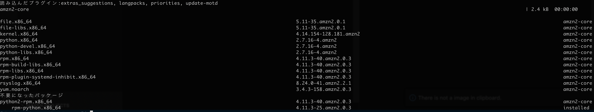

# root パスワード設定
以下でパスワードを設定する。  
```
$ sudo su
$ passwd root
```

# yum のアップデート
`$ yum check-update`  
  

updateは、rootユーザで行う  
`# yum update`  

# タイムゾーンの設定
https://qiita.com/azusanakano/items/b39bd22504313884a7c3