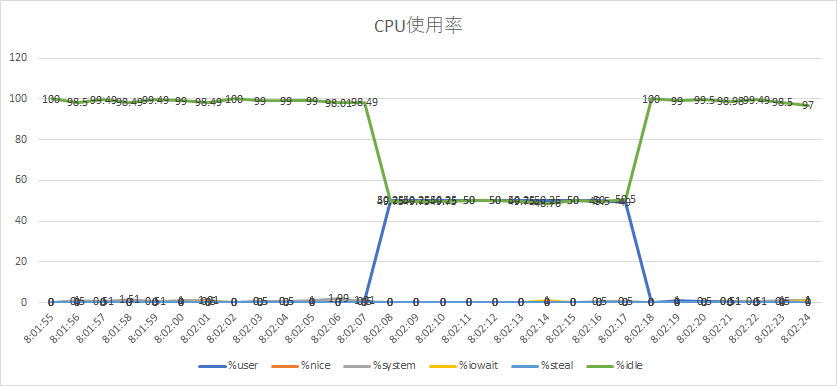
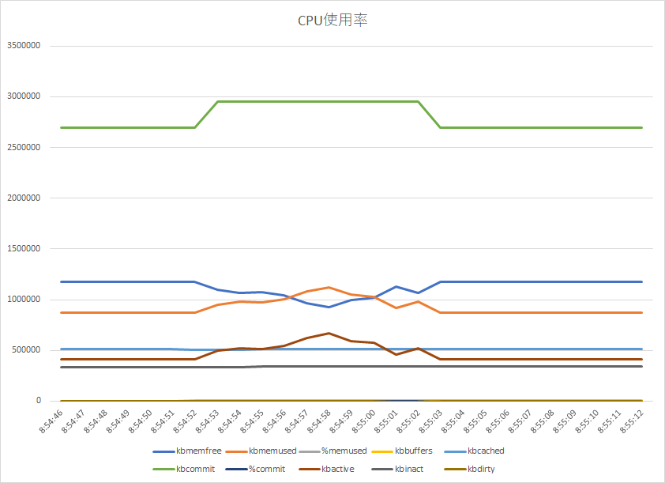

# stress
  負荷をかけるコマンド

## install
```
# yum -y install epel-release
# yum -y install stress
```

## CPUに負荷をかける
```
# stress --cpu
```
### 負荷をかけてみる
1つのコアを10秒間負荷をかける。
```
# stress --cpu 1 --timeout 10s
```
取得結果
```
Linux 4.9.184-linuxkit (ebd7455b628a)   02/03/20        _x86_64_        (2 CPU)

08:01:54        CPU     %user     %nice   %system   %iowait    %steal     %idle
08:01:55        all      0.00      0.00      0.00      0.00      0.00    100.00
08:01:56        all      0.50      0.00      1.00      0.00      0.00     98.50
08:01:57        all      0.00      0.00      0.51      0.00      0.00     99.49
08:01:58        all      0.00      0.00      1.51      0.00      0.00     98.49
08:01:59        all      0.00      0.00      0.51      0.00      0.00     99.49
08:02:00        all      0.00      0.00      1.00      0.00      0.00     99.00
08:02:01        all      0.00      0.00      1.01      0.50      0.00     98.49
08:02:02        all      0.00      0.00      0.00      0.00      0.00    100.00
08:02:03        all      0.50      0.00      0.50      0.00      0.00     99.00
08:02:04        all      0.50      0.00      0.50      0.00      0.00     99.00
08:02:05        all      0.00      0.00      1.00      0.00      0.00     99.00
08:02:06        all      0.00      0.00      1.99      0.00      0.00     98.01
08:02:07        all      1.01      0.00      0.50      0.00      0.00     98.49
08:02:08        all     50.25      0.00      0.00      0.00      0.00     49.75
08:02:09        all     50.25      0.00      0.00      0.00      0.00     49.75
08:02:10        all     50.25      0.00      0.00      0.00      0.00     49.75
08:02:11        all     50.00      0.00      0.00      0.00      0.00     50.00
08:02:12        all     50.00      0.00      0.00      0.00      0.00     50.00
08:02:13        all     50.25      0.00      0.00      0.00      0.00     49.75
08:02:14        all     50.25      0.00      0.00      1.00      0.00     48.76
08:02:15        all     50.00      0.00      0.00      0.00      0.00     50.00
08:02:16        all     50.00      0.00      0.50      0.00      0.00     49.50
08:02:17        all     49.00      0.00      0.50      0.00      0.00     50.50
08:02:18        all      0.00      0.00      0.00      0.00      0.00    100.00
08:02:19        all      1.00      0.00      0.00      0.00      0.00     99.00
08:02:20        all      0.50      0.00      0.00      0.00      0.00     99.50
08:02:21        all      0.51      0.00      0.51      0.00      0.00     98.98
08:02:22        all      0.00      0.00      0.51      0.00      0.00     99.49
08:02:23        all      0.50      0.00      1.00      0.00      0.00     98.50
08:02:24        all      1.00      0.00      1.00      1.00      0.00     97.00
```
この仮想環境では、コア数が2つである。  
取得結果より08:02:08から08:02:17までの間1つのコアが全力で回っていることが確認できた。  


## メモリに負荷をかける
```
# stress --vm --vm-bytes
```
### 負荷をかけてみる
```
# stress --vm 2 --vm-bytes 128m --timeout 10s
```
取得結果
```
08:54:45    kbmemfree kbmemused  %memused kbbuffers  kbcached  kbcommit   %commit  kbactive   kbinact   kbdirty
08:54:46      1175720    871288     42.56      8904    514492   2692868     86.99    414788    338604        12
08:54:47      1175720    871288     42.56      8904    514492   2692868     86.99    414788    338604        12
08:54:48      1175720    871288     42.56      8904    514492   2692868     86.99    414792    338604        12
08:54:49      1175720    871288     42.56      8904    514492   2692868     86.99    414808    338604        12
08:54:50      1175720    871288     42.56      8904    514492   2692868     86.99    414824    338604        12
08:54:51      1175736    871272     42.56      8904    514492   2692868     86.99    414824    338604        12
08:54:52      1175736    871272     42.56      8912    514484   2692868     86.99    414824    338604        12
08:54:53      1096312    950696     46.44      8912    514484   2956004     95.49    494456    338604        12
08:54:54      1067668    979340     47.84      8912    514484   2956004     95.49    523016    338604        12
08:54:55      1076968    970040     47.39      8912    514496   2956004     95.49    513804    338612        16
08:54:56      1042744   1004264     49.06      8912    514496   2956004     95.49    547968    338612         4
08:54:57       965616   1081392     52.83      8912    514496   2956004     95.49    624808    338612         4
08:54:58       923828   1123180     54.87      8912    514496   2956004     95.49    666604    338612         4
08:54:59       999656   1047352     51.17      8920    514488   2956004     95.49    589584    338612         4
08:55:00      1016952   1030056     50.32      8920    514496   2956004     95.49    573720    338612        16
08:55:01      1130660    916348     44.77      8920    514496   2956004     95.49    460160    338612         0
08:55:02      1068860    978148     47.78      8920    514496   2956004     95.49    520220    338612         0
08:55:03      1175076    871932     42.60      8920    514496   2693852     87.02    415016    338612         4
08:55:04      1175076    871932     42.60      8920    514496   2693852     87.02    415024    338612         4
08:55:05      1175076    871932     42.60      8920    514500   2693852     87.02    415024    338612         8
08:55:06      1175076    871932     42.60      8920    514500   2693852     87.02    415024    338612         8
08:55:07      1175116    871892     42.59      8920    514500   2693852     87.02    415040    338612         8
08:55:08      1175116    871892     42.59      8920    514500   2693852     87.02    415040    338612         8
08:55:09      1175116    871892     42.59      8928    514492   2693852     87.02    415040    338612         8
08:55:10      1175116    871892     42.59      8928    514496   2693852     87.02    415044    338612        12
08:55:11      1175116    871892     42.59      8928    514496   2693852     87.02    415044    338612        12
08:55:12      1175116    871892     42.59      8928    514496   2693852     87.02    415044    338612        12
```
取得結果より08:54:52から08:55:03までの間1つのコアが全力で回っていることが確認できた。  
